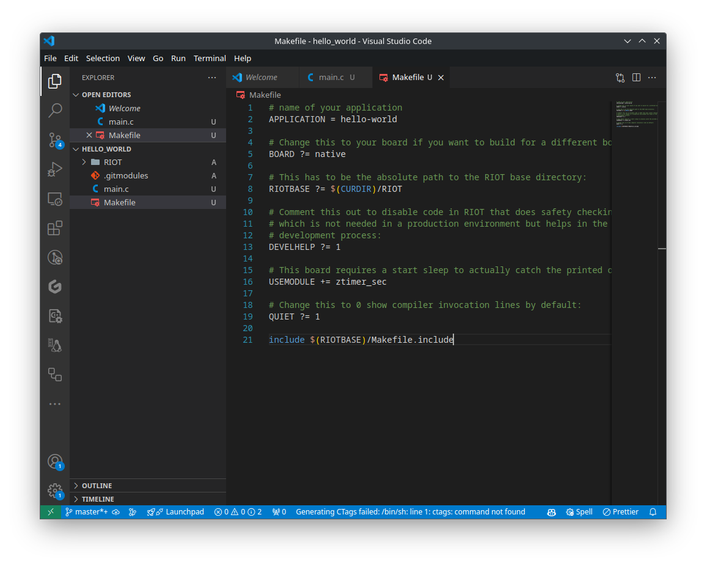
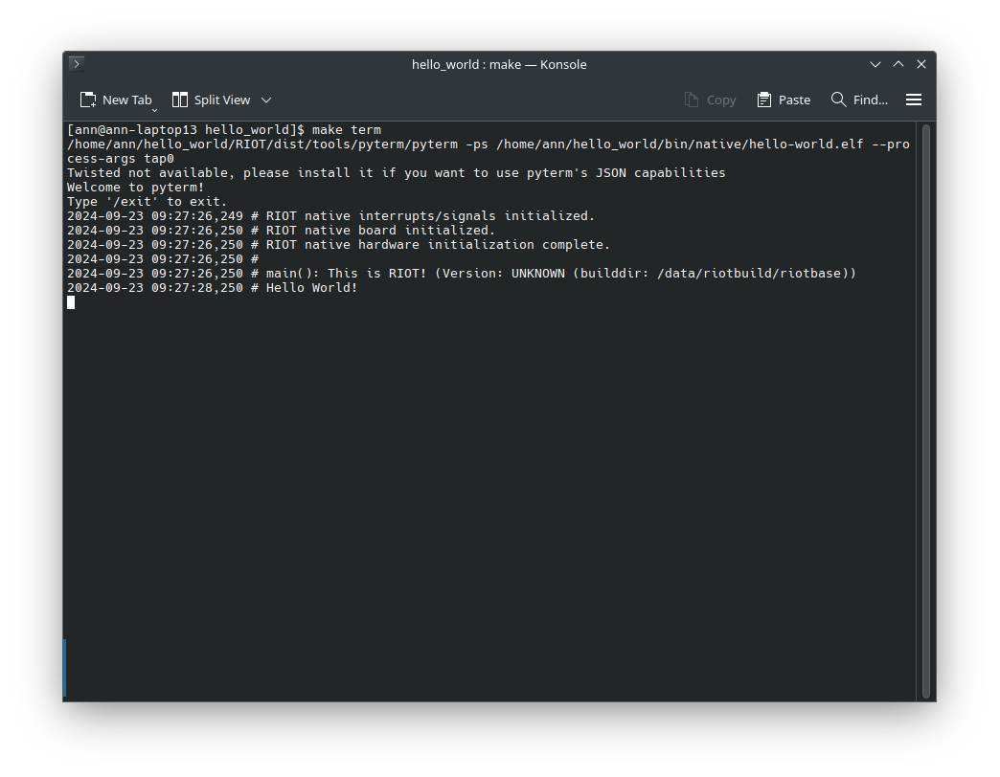

import Contact from '../../../components/contact.astro';
import GitSetup from '../../../components/gitsetup.mdx';

## Step 1: Create a new project

<GitSetup />

## Step 2: Creating our hello world program

Now that we have added RIOT as a submodule to our project, we can start writing our hello world program. To do this, we create a new file called `main.c` in the `hello_world` directory. You can use any text editor to create this file. We will use Visual Studio Code in this example. To open Visual Studio Code in the directory, you can use the following command:

```bash
code .
```

Now that Visual Studio Code is open, we create a new file called `main.c` and add the following code:

```c
#include <stdio.h>
#include "ztimer.h"

int main(void)
{
    ztimer_sleep(ZTIMER_SEC, 3);

    puts("Hello World!");

    return 0;
}
```


This program will print "Hello World!" to the console after sleeping for 3 seconds. We use the `ztimer_sleep` function to sleep for 3 seconds otherwise we will most likely miss the output before connecting to our device. This function is part of the `ztimer` module, which is part of RIOT. The `puts` function is part of the standard C library and is used to print a string to the console.

## Step 3: Creating the Makefile

Now that we have created our hello world program, we need to create a Makefile to build our program. The Makefile is a build automation tool that allows us to define how our program should be built. We create a new file called `Makefile` in the `hello_world` directory and add the following code:

```makefile
# name of your application
APPLICATION = hello-world

# Change this to your board if you want to build for a different board
BOARD ?= native

# This has to be the absolute path to the RIOT base directory:
RIOTBASE ?= $(CURDIR)/RIOT

# Comment this out to disable code in RIOT that does safety checking
# which is not needed in a production environment but helps in the
# development process:
DEVELHELP ?= 1

# This board requires a start sleep to actually catch the printed output
USEMODULE += ztimer_sec

# Change this to 0 show compiler invocation lines by default:
QUIET ?= 1

include $(RIOTBASE)/Makefile.include
```



Congratulations! You have now created a new project with a simple hello world program. In the next step, we will build and run our program just like we did in the "Getting Started" guide.

## Step 4: Building and running the program

<Contact />

To build our program, we use the following command:

```bash
BUILD_IN_DOCKER=1 make flash
```

:::note
The `BUILD_IN_DOCKER=1` flag tells the build system to use the docker image provided by RIOT to build our program. This ensures that we have all the necessary dependencies to build our program. If you have already built RIOT on your system, you can omit this flag and the build system will use the toolchain installed on your system.
:::


After building the program, we can run it using the following command to start the RIOT shell:

```bash
make term
```

If everything went well, you should see our hello world program printing "Hello World!" to the console after 3 seconds.



Hooraay! You have successfully created a new project with a simple hello world program.

:::tip
Before you push your project to a git hosting service such as Github, make sure to add a `.gitignore` file to your project to exclude unnecessary files from being tracked by git.

For this project, a `.gitignore` file could look like this:

```bash title=".gitignore"
# Ignore build artifacts
bin/
*.bin
*.elf
*.hex
*.map
*.lst
*.o
*.d
*.a
*.out
```
:::

## Conclusion

In this tutorial, we have created a new project with a simple hello world program. We have added RIOT as a submodule to our project, created a hello world program, and built and run the program using the RIOT build system. You can now start building your own applications using RIOT and explore the vast possibilities that RIOT has to offer.

:::note
The source code for this tutorial can be found [HERE](https://github.com/AnnsAnns/RIOT-Tutorial-Repository/tree/01_hello_world).

If your project is not working as expected, you can compare your code with the code in this repository to see if you missed anything.
:::
