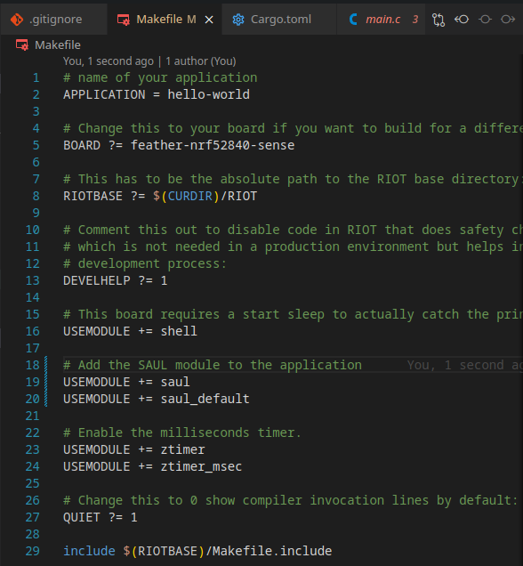

In the previous chapter we learned how to interact with the GPIO directly, but RIOT provides a more abstract way to interact with sensors and actuators. RIOT calls this the SAUL (Sensors/Actuators Abstraction Layer) system.

The availability of sensors and actuators can vary greatly between different boards, so the SAUL system provides a way to interact with them in a uniform way, regardless of the underlying hardware. So consulting the [documentation](https://doc.riot-os.org/group__drivers__saul.html) is always a good idea.

## Using the SAUL System

First we need to include the necessary module in the `Makefile`, to do this
add the following line to the `Makefile`:

```makefile
USEMODULE += saul
USEMODULE += saul_default
```




# Conclusion

@TODO: Add conclusion

:::note
The source code for this tutorial can be found [HERE](https://github.com/AnnsAnns/RIOT-Tutorial-Repository/tree/07_saul).

If your project is not working as expected, you can compare your code with the code in this repository to see if you missed anything.
:::
