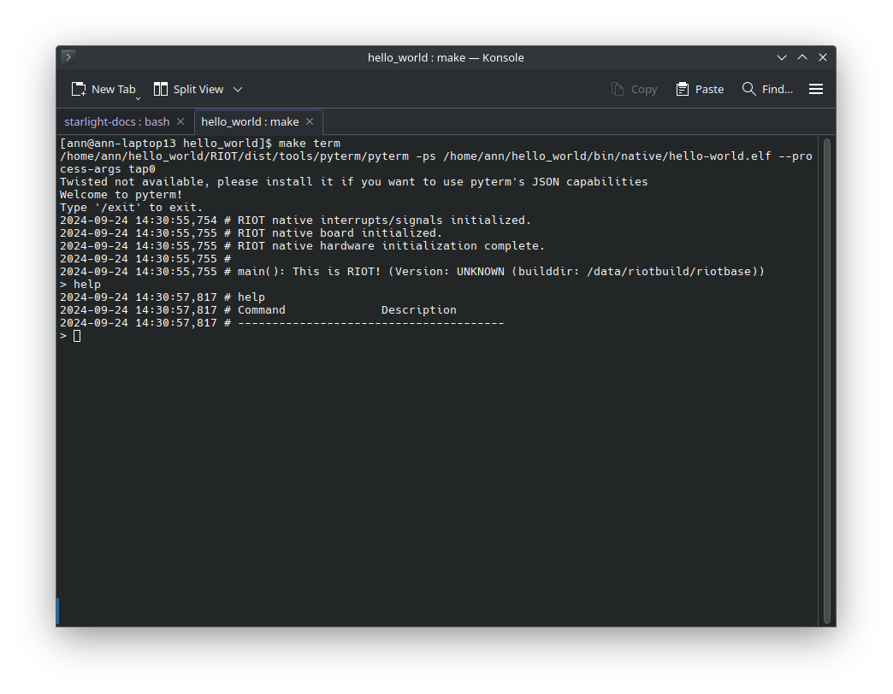
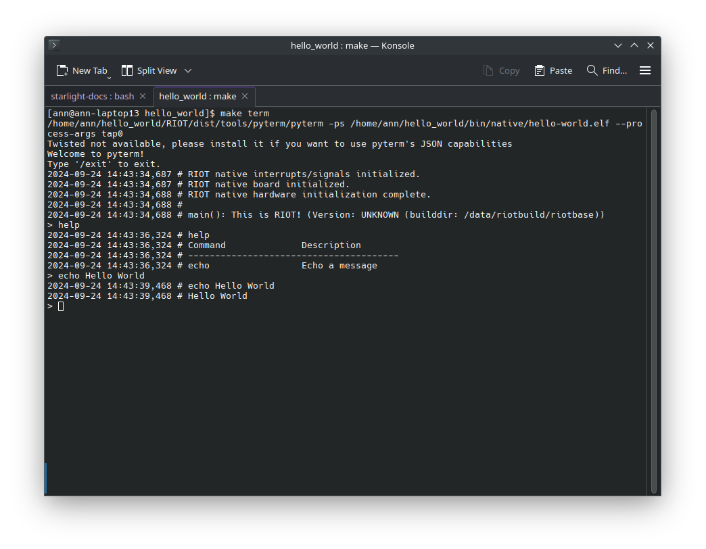

The shell is a powerful tool in RIOT that allows you to interact with your application at runtime.
You can use the shell to inspect the state of your application, change configuration parameters, and even run tests.

In this tutorial, we will take a look at how to use the shell in RIOT and how to create custom shell commands.

## Step 1: Using the Shell

We need to include the shell module in our application to use the shell. As we did in the previous tutorials, we will have to go into the `Makefile` of our application and add the following line:

```make
USEMODULE += shell
```

This line tells the build system to include the shell module in our application. Now we can use the shell in our application.



Now we can start the shell in our main function by calling the `shell_init` function. Go into your `main.c` file and include the following code:

```c
#include "shell.h"

int main(void)
{
    // Buffer to store command line input
    char buffer[SHELL_DEFAULT_BUFSIZE];

    // Start the shell
    shell_run(NULL, buffer, SHELL_DEFAULT_BUFSIZE);

    return 0;
}
```

There are two importants things to note here.
First, we have to provide a buffer to the shell, the shell will then use this buffer to store your input.
For this example, we use the `SHELL_DEFAULT_BUFSIZE` macro to define the size of the buffer but you can use any size you want (as long as it is big enough to store your input).

The second thing to note is that we pass `NULL` as the first argument to the `shell_run` function. This argument is used to pass a list of shell commands to the shell, but we will take a look at that in the next step.

Now we can build and run our program. Compile the program using `make` and flash it to your board using `make flash`.

If you look into the terminal via `make term` you should see the shell prompt. You can now type shell commands and interact with your application.
For example, you can type `help` to get a list of available commands ... which is not very exciting at the moment because we don't have any custom commands.


## Step 2: Creating Custom Shell Commands

Creating custom shell commands is quite simple. You just have to define a function that implements the command and register it with the shell.
RIOT provides a set of macros to make this process easier.

Let's create a simple shell command that echoes back the input. Go into your `main.c` file and include the following code:

```c
#include <stdio.h>

int echo_command(int argc, char **argv)
{
    for (int i = 1; i < argc; i++) {
        printf("%s ", argv[i]);
    }
    printf("\n");

    return 0;
}
```

This function takes two arguments: `argc` and `argv`. `argc` is the number of arguments passed to the command and `argv` is an array of strings containing the arguments.

Now all that is left is to register the command with the shell. Go back to your `main.c` file and include the following code _outside_ of the `main` function:

```c
SHELL_COMMAND(echo,
              "Echoes back the input",
              echo_command);
```

This macro takes three arguments: the name of the command, a short description of the command, and the function that implements the command.

And that's it! You have created a custom shell command. Now you can build and run your program again and type `echo hello world` in the shell to see the command in action.



## Conclusion

In this tutorial, we have learned how to use the shell in RIOT and how to create custom shell commands.

:::note
The source code for this tutorial can be found [HERE](https://github.com/AnnsAnns/RIOT-Tutorial-Repository/tree/04_shell).

If your project is not working as expected, you can compare your code with the code in this repository to see if you missed anything.
:::
