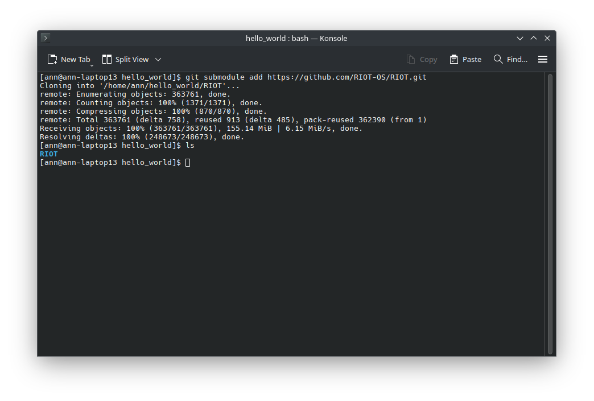
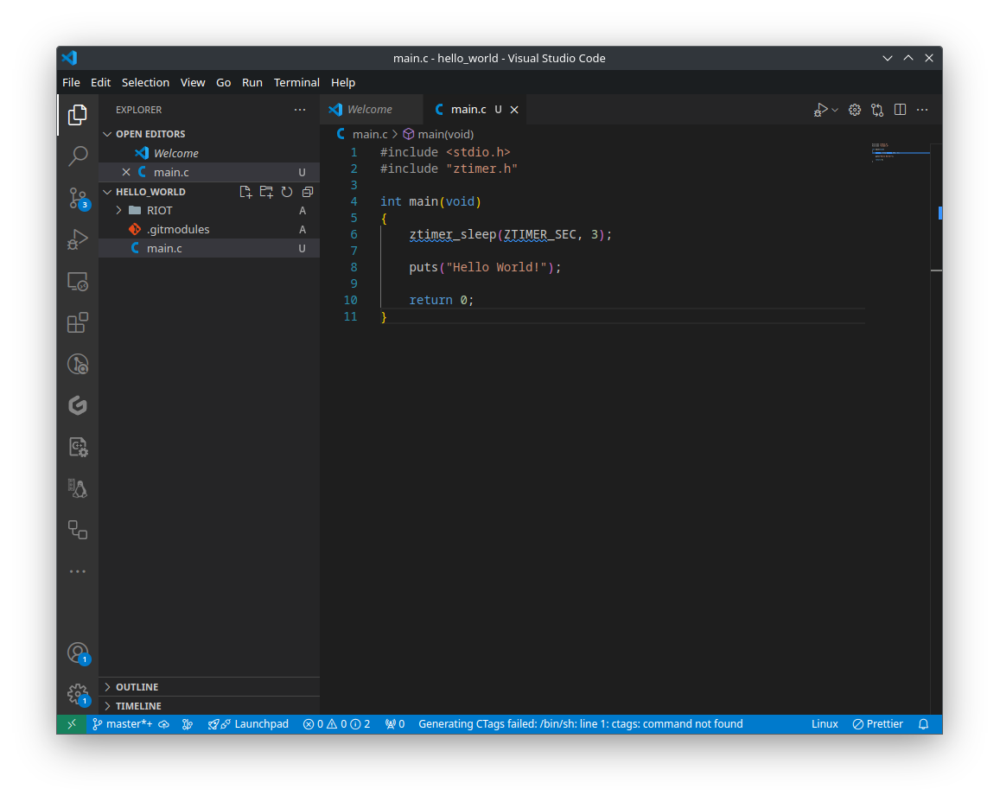

import Contact from '../../../components/contact.astro';

Now that we have played around with the examples and have a basic understanding of how to use RIOT, let's create a new project from scratch. We will create a simple hello world program that will print "Hello World!" to the console.

## Step 1: Create a new project

We start by creating a new git repository for our project. If you have never worked with git before, you can find a good introduction [here](https://git-scm.com/book/en/v2/Getting-Started-About-Version-Control) or [here](https://docs.github.com/en/get-started/getting-started-with-git/set-up-git).

Let's create a new directory for our project in which we will store our code. We will call this directory `hello_world`.

```bash
mkdir hello_world && cd hello_world
```

Next, we initialize a new git repository in this directory. This will allow us to track changes to our code and collaborate with others and also allows us to easily get RIOT as a submodule.

```bash
git init
```


Congratulations! You have now created a new empty git repository. In the next step, we will add RIOT as a submodule to our project.

## Step 2: Add RIOT as a submodule

We want to import RIOT as a submodule to our project. This will allow us to easily update to newer versions of RIOT and also allows us to easily share our project with others on GitHub, Gitlab, or any other git hosting service.

To add RIOT as a submodule, we use the following command:

```bash
git submodule add https://github.com/RIOT-OS/RIOT.git
```



When looking into our directory via `ls`, we can see that a new directory called `RIOT` has been created. This directory contains the RIOT source code. If you were to push your project to a git hosting service, the `RIOT` directory would not be included in the repository. Instead, the repository would contain a reference to the commit of the RIOT repository that you have added as a submodule. This way, the repository stays small and only contains the code that you have written and not the entire RIOT source code.

## Step 3: Creating our hello world program

Now that we have added RIOT as a submodule to our project, we can start writing our hello world program. To do this, we create a new file called `main.c` in the `hello_world` directory. You can use any text editor to create this file. We will use Visual Studio Code in this example. To open Visual Studio Code in the directory, you can use the following command:

```bash
code .
```

Now that Visual Studio Code is open, we create a new file called `main.c` and add the following code:

```c
#include <stdio.h>
#include "ztimer.h"

int main(void)
{
    ztimer_sleep(ZTIMER_SEC, 3);

    puts("Hello World!");
    
    return 0;
}
```



This program will print "Hello World!" to the console after sleeping for 3 seconds. We use the `ztimer_sleep` function to sleep for 3 seconds otherwise we will most likely miss the output before connecting to our device. This function is part of the `ztimer` module, which is part of RIOT. The `puts` function is part of the standard C library and is used to print a string to the console.

## Step 4: Creating the Makefile

Now that we have created our hello world program, we need to create a Makefile to build our program. The Makefile is a build automation tool that allows us to define how our program should be built. We create a new file called `Makefile` in the `hello_world` directory and add the following code:

```makefile
# name of your application
APPLICATION = hello-world

# Change this to your board if you want to build for a different board
BOARD ?= native

# This has to be the absolute path to the RIOT base directory:
RIOTBASE ?= $(CURDIR)/RIOT

# Comment this out to disable code in RIOT that does safety checking
# which is not needed in a production environment but helps in the
# development process:
DEVELHELP ?= 1

# This board requires a start sleep to actually catch the printed output
USEMODULE += ztimer_sec

# Change this to 0 show compiler invocation lines by default:
QUIET ?= 1

include $(RIOTBASE)/Makefile.include
```


Congratulations! You have now created a new project with a simple hello world program. In the next step, we will build and run our program just like we did in the "Getting Started" guide.

## Step 5: Building and running the program

<Contact />

To build our program, we use the following command:

```bash
BUILD_IN_DOCKER=1 make
```

:::note
The `BUILD_IN_DOCKER=1` flag tells the build system to use the docker image provided by RIOT to build our program. This ensures that we have all the necessary dependencies to build our program. If you have already built RIOT on your system, you can omit this flag and the build system will use the toolchain installed on your system.
:::


After building the program, we can run it using the following command to start the RIOT shell:

```bash
make term
```

If everything went well, you should see our hello world program printing "Hello World!" to the console after 3 seconds.

