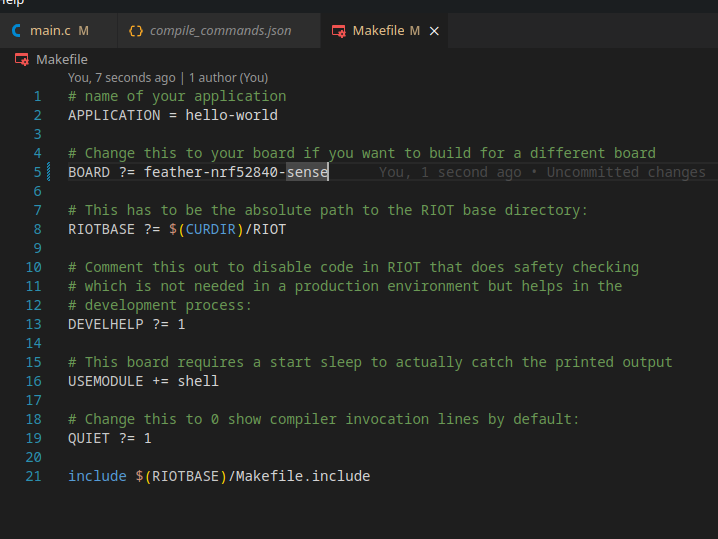
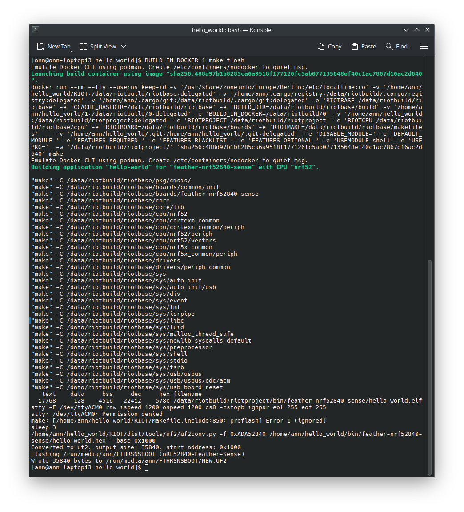
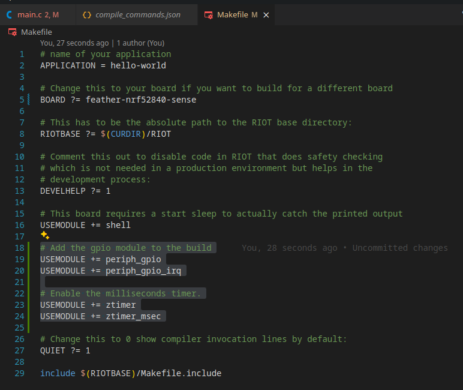
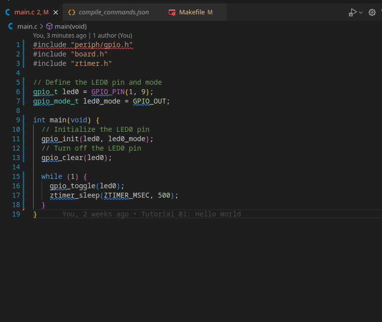
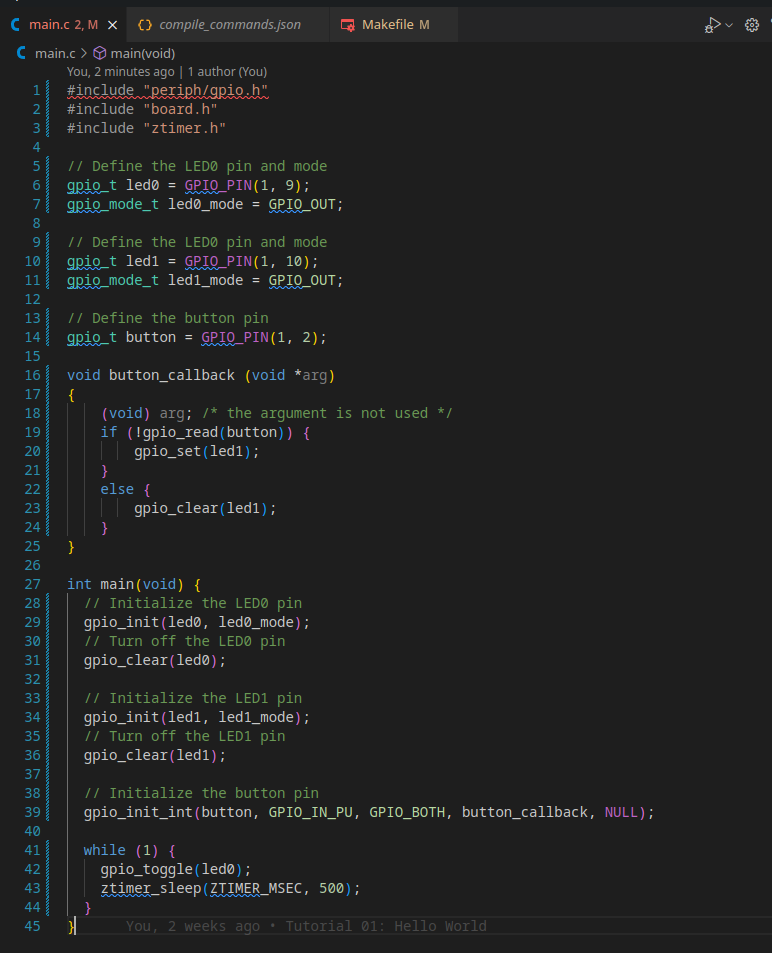

import Contact from '../../../components/contact.astro';
import WorkingVideo from './img/06_gpio/05_working_video.mp4';

So far we have been running all our code using the `feather-nrf52840-sense` board. 

In this tutorial, we will learn how to use the GPIO pins on a real board to control LEDs or read button presses.

For this tutorial I will be using a the `feather-nrf52840-sense` board with the [Teamagochi PCB](https://github.com/smartuni/teamagochi), but you can use any board that has GPIO pins.

## Step 1: Configuring our Board

<Contact />

First, we need to actually inform RIOT about the board we are using. 

To do this we need to change the `BOARD` variable in our `Makefile` to the board we are using.

```make
BOARD ?= feather-nrf52840-sense
```



Try flashing the board with `make flash` and see if it works, 
it should still execute the same code as before but now using the actual board.



:::caution
It might return something like:

```
/bin/sh: line 1: arm-none-eabi-gcc: command not found
Compiler arm-none-eabi-gcc is required but not found in PATH.  Aborting.
```

This means that you need to install the ARM toolchain, 
you can do this by running `sudo apt install gcc-arm-none-eabi` on Ubuntu
or `sudo pacman -S arm-none-eabi-gcc` on Arch Linux.

If it still doesn't work, consider running it via the Docker container using `BUILD_IN_DOCKER=1 make flash`.

Please refer to the [Flashing a RIOT Application](/getting-started/flashing) guide for more information.
:::

Now if we type `make term` we should see the output of the board in the terminal.
Make sure that you have the board connected to your computer via USB and
that your user has the necessary permissions to access the serial port.

:::tip
On Arch Linux, you might need to add your user to the `uucp` group to access the serial port.

```bash
sudo usermod -a -G uucp $USER
```
:::

## Step 2: Controlling LEDs

Now that we have the board working, let's try to control the LEDs on the board.

The exact pins that control the LEDs might vary depending on the board you are using,
but in the case of the `feather-nrf52840-sense` board, the LED would be connected 
on Port 1 Pin 9.

First we need to include the necessary modules in our projects `Makefile`.

```make
# Add the gpio module to the build
USEMODULE += periph_gpio
USEMODULE += periph_gpio_irq

# Enable the milliseconds timer.
USEMODULE += ztimer
USEMODULE += ztimer_msec
```



This allows us to both control the GPIO pins and timers.

Now we need to actually define the pin that we want to control in our code. 
To do this include the following lines **before** the `main` function.

```c
#include "periph/gpio.h"
#include "board.h"
#include "ztimer.h"

// Define the LED0 pin and mode
gpio_t led0 = GPIO_PIN(1, 9);
gpio_mode_t led0_mode = GPIO_OUT;
```

Now we can control the LED by first initializing the pin and then clearing or setting it.

```c
int main(void) {
  // Initialize the LED0 pin
  gpio_init(led0, led0_mode);
  // Turn off the LED0 pin
  gpio_clear(led0);

  while (1) {

  }
}
```

This code will turn off the LED when the board starts which is quite boring,
so let's make it blink by adding a delay and toggling the LED.

```c
while (1) {
    gpio_toggle(led0);
    ztimer_sleep(ZTIMER_MSEC, 500);
}
```



If we now `make flash` and then `make term` we should see the LED blinking.

<video controls>
  <source src={WorkingVideo} type="video/mp4" />
  Your browser does not support the video tag.
</video>

## Step 3: Reading Button Presses

If you remember what we did in the timers tutorial,
we can use quite similar code to read button presses.

On a constrained device you usually don't want to poll the button state,
which is why we will use an interrupt to detect the button press,
that way we can drastically reduce the power consumption of the device.

First we need to define the callback function that will be called when the button is pressed.

```c
// Define the LED0 pin and mode
gpio_t led1 = GPIO_PIN(1, 10);
gpio_mode_t led1_mode = GPIO_OUT;

void button_callback (void *arg)
{
    (void) arg; /* the argument is not used */
    if (!gpio_read(button)) {
        gpio_set(led1);
    }
    else {
        gpio_clear(led1);
    }
}
```

Now we need to define the button pin and mode and initialize it.

```c
// Define the button pin and callback
gpio_t button = GPIO_PIN(1, 2);

int main(void) {
    gpio_init_int(button, GPIO_IN_PU, GPIO_BOTH, button_callback, NULL);
}
```

This code will initialize the button pin and call the `button_callback` function whenever the button is pressed.



If we now `make flash` and then `make term` we should see the LED turn on when the button is pressed.

:::tip
If you are using the `feather-nrf52840-sense` board, the button is on the back of the board.

Be careful to not press the reset button by mistake 😉
:::

## Conclusion

In this tutorial we learned how to use the GPIO pins on a real board to control LEDs or read button presses.

This is a very basic example, but it should give you a good starting point to build more complex applications.

<Contact />

:::note
The source code for this tutorial can be found [HERE](https://github.com/AnnsAnns/RIOT-Tutorial-Repository/tree/06_gpio). 

If your project is not working as expected, you can compare your code with the code in this repository to see if you missed anything.
:::

